

<a href="https://github.com/cire-thk/BifacialSimu/blob/master/LICENSE">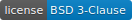</a>

***
# BifacialSimu
BifacialSimu is an open source simulation program designed to simulate and portray the potential benefits of bifacial solar in comparison to standard monofacial solar modules. 
BifacialSimu allows for the combination of different radiation, albedo and electrical simulation modes, so that multiple scenarios are covered. 
A defining feature of which is the capability to combine both View Factors and Ray Tracing methods for fast, accurate simulation results.

***
## Contents
1. [Introduction](#introduction)
2. [Prerequisites](#prerequisites)
3. [Installation](#installation)
4. [Quick Start](#quick-start)
5. [GUI](#gui)
6. [Examples](#examples)
7. [Results](#results)
8. [Troubleshooting](#troubleshooting)
9. [Program Function](#program-function)
10. [Contribution](#contribution)
11. [Citation](#citation)
12. [License](#license)

***
## Introduction
This program was developed as part of the doctorate work by [Eva-Maria Grommes](https://orcid.org/0000-0002-7826-3754) and developed with the assistance of [other students from the TH Köln](#contribution). 
It is intended to provide a free, effective tool to simulate the energy yield of bifacial PV technology, thereby proving their advantages and applications. 
This Readme guide will assist with the installation and operation of the program, providing a quick start to simulating bifacial modules.
Basically it is devided into three different simulations, in which each you can choose between different calculation models as displayed below:

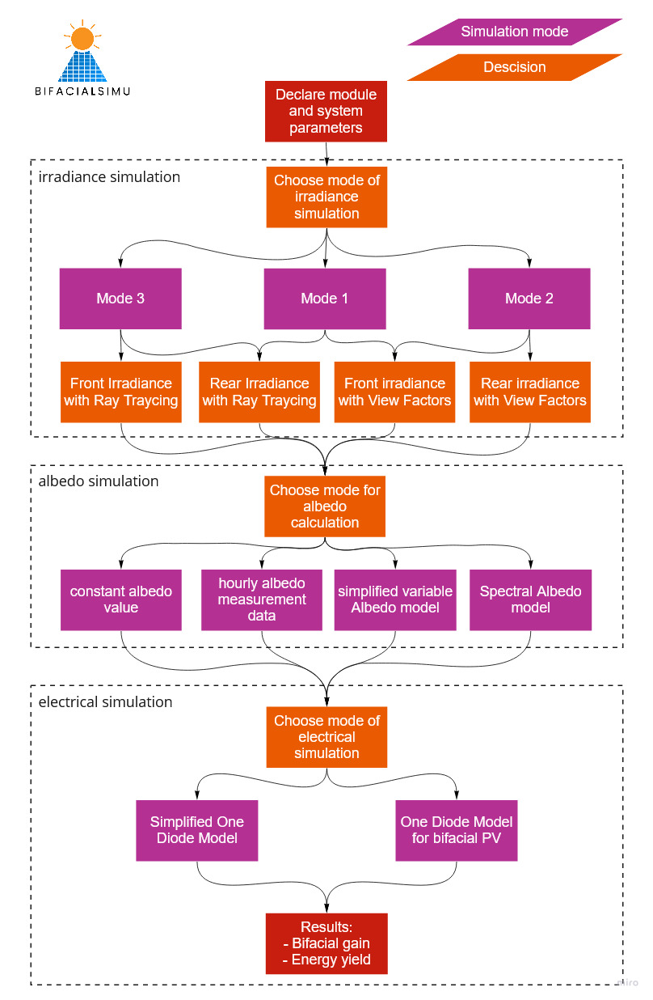 

***

## Prerequisites
BifacialSimu is run within a Python environment and dependent on a variety of libraries, most of which are contained within the installation of Anaconda. 
The program [Radiance](https://github.com/NREL/Radiance/releases) is necessary in order to run BifacialSimu. Besides that relies BifacialSimu on following libraries:
>bifacial_radiance==0.4.1  
>ipython==8.4.0   
>matplotlib==3.4.3  
>numpy==1.20.3  
>pandas==1.3.4  
>Pillow==9.1.1  
>pvfactors==1.5.2   
>pvlib==0.9.1  
>python_dateutil==2.8.2  
>pytz==2021.3  
>requests==2.26.0  
>seaborn==0.11.2  
>Shapely==1.8.2  
>tqdm==4.62.3  

The installation process of which can be found in the following section.
***
## Installation

Installation of BifacialSimu is a multi-stage process as it is dependent on a number of other python based tools and programs, combining them to create a comprehensive simulation tool. 
Make sure to follow these steps closely and before proceeding, read through the entire instructions.

A useful resource for the installation is this [video](https://www.youtube.com/watch?v=4A9GocfHKyM), which covers the following installation steps for bifacial_radiance (necessary for BifacialSimu):

1. Install Anaconda
2. Install Radiance
3. Install Radiance executables (jaloxa)
4. Check Environment Variables
5. Install pvlib
6. Install bifacial_radiance
7. Install gencumulativesky.exe

These steps are described below in detail as well, including the intallation of pv_factors, another important tool used by BifacialSimu.

__Installation of Anaconda__

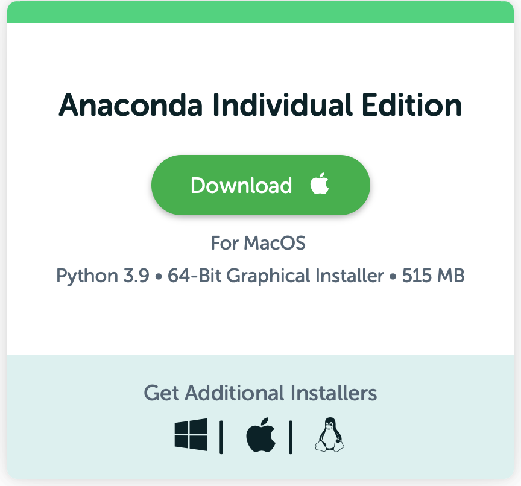 

Anaconda is a Python/R data science distribution, which can be used to run python and related packages. 
Even if you already have another python environment installed it is still recommended to use Anaconda.  
− For Windows: follow the installation instructions [here](https://docs.anaconda.com/anaconda/install/windows/) Note: in Step 8 "with Path" should be selected, this is important for the correct installation of bifacial_radiance\
− For Mac OS X: follow the installation instructions [here](https://docs.anaconda.com/anaconda/install/mac-os/)  
− For other operating systems: follow the installation instructions regarding your system [here](https://docs.anaconda.com/anaconda/install/ )

__Installation of Radiance__  
for Mac OS X: The installation of XQuartz is required for Radiance to run, this emulates a Windows environment for the program.

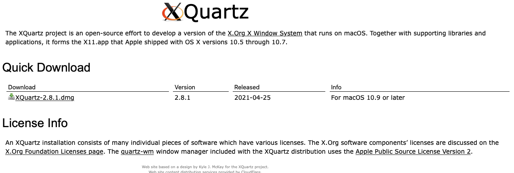 

An in-depth guide and the installation of Radiance can be found on the [Radiance Github Page](https://github.com/NREL/Radiance/releases). 
Make sure to download the correct package according to your operating system.

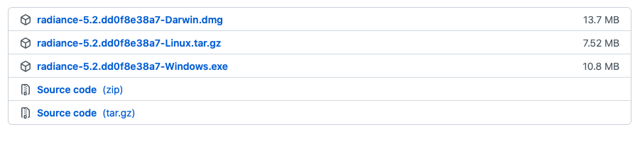 

Make sure to download and insert the jaloxa Windows Binaries into the Radiance bin folder, these can be downloaded [here](http://www.jaloxa.eu/resources/radiance/radwinexe.shtml).

__Install BifacialSimu__

To install BifacialSimu and Copies of [bifacial_radiance](https://github.com/NREL/bifacial_radiance) and [pvfavtors](https://github.com/SunPower/pvfactors), you can use:
> pip install BifacialSimu

If that does not work for you, navigate to your local GitHub folder or download BifacialSimu on GitHub. 
In spyder for example you can navigate using __cd__:
> cd C:\Users\XXX\XXX\GitHub\bifacialSimu

Now use:
> pip install . 

Check, if these standard python packages have been installed:  
− [Pvlib](https://pvlib-python.readthedocs.io/en/stable/index.html)  
− [Pvfactors](https://sunpower.github.io/pvfactors/ ) 

You can find these packages in the Anaconda navigator under “Environments” using the search bar in the upper right corner. 
The newest version number will be highlighted in blue and you can update the package regarding the manual [here](https://docs.anaconda.com/anaconda/navigator/tutorials/manage-packages/)  

You can check the current version of:\
− [Pvlib](https://sunpower.github.io/pvfactors/)  
− [Pvfactors](https://sunpower.github.io/pvfactors/whatsnew.html)

Important! Make sure to update Anaconda regularly to keep your python packages updated! 

After a sucessfull installation, you can run the GUI.py in the BifacialSimu\BifacialSimu_src folder.

__Run BifacialSimu__  
− Open Spyder within the Anaconda Navigator  
− Open the GUI.py file in spyder   
− Run the GUI.py file. 

***
## Quick Start
This section serves as a Quick Start and also a way of checking that everything has installed correctly, using a base default simulation which can then be adjusted as a way of learning how to operate BifacialSimu and becoming comfortable with the outputs and results.

As a first step, initiate the GUI by running the GUI.py file within your Python operating environment (Spyder or similar) as per the installation instructions. 
This will then open the Graphical User Interface in a separate window and should look as per below.

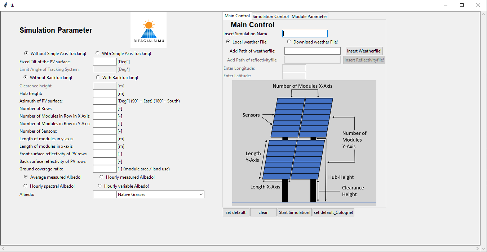 

By clicking on the button "set default!" all active fields should be filled and ready to simulate. 
Check that these match the below picture 

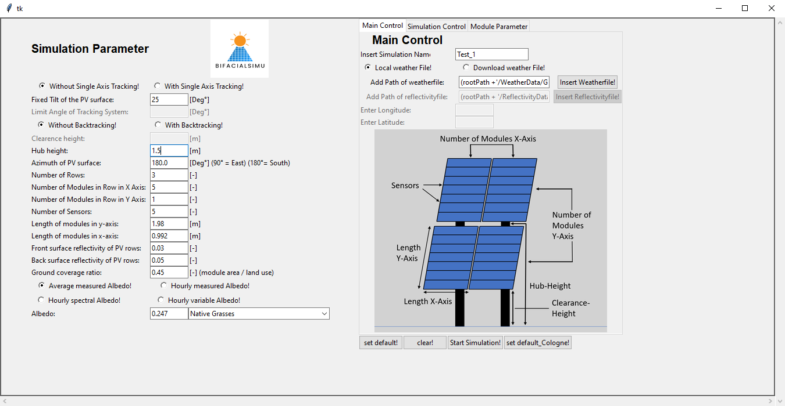 

Before starting the simulation check the Simulation Control and Module Parameter tabs. 
It may also be advantageous to reduce the simulation time period for this test to one or two days in order to reduce actual simulation time, as per the below example, to one day.

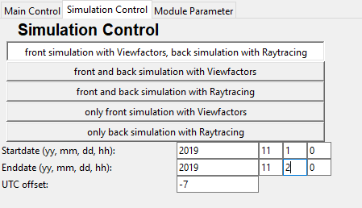 

Now check under Module Parameters that all relevant parameters have been filled in, this is also where you can choose a module with the drop down box.

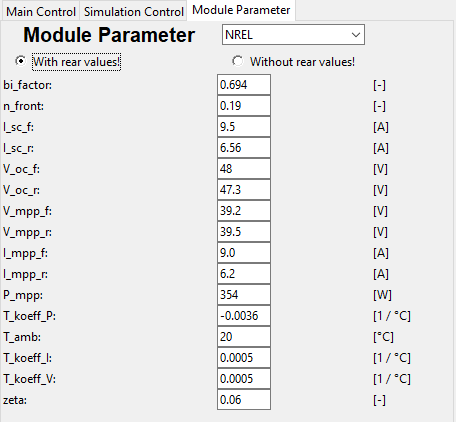 

The simulation can now be carried out by clicking on the button "Start Simulation!" under Main Control. 
This may take a while depending upon your computer's specifications, please have patience.

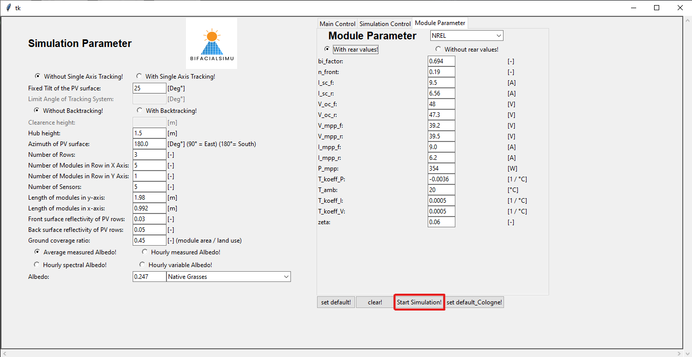 

Once this has completed a variety of graphs will be produced which can be further analysed and exported. Incidentally, the data for these graphs will have been saved in the designated outputs folder produced for this specific simulation which can be found in the same folder as the installation of BifacialSimu:

For a more in-depth explanation of these graphs and what each of them mean please refer to the section [Results](#results)

Providing that everything has been installed correctly and is functioning properly you can move onto the detailed explanation of the GUI found in the next section.

If, however, any error messages have occured or the simulation doesn't complete please refer to the [Troubleshooting](#troubleshooting) section found later in this document.
***

## GUI

The GUI provides access to all necessary boundary conditions for simulation within the following sections:

### **Simulation Parameter**
The overarching simulation parameters can be set within this section. These are related to the physical attributes of the entire system such as angle and orientation of the modules. This is where the structure of the PV Array is built, and features such as tracking and which type of surface they are installed on are integrated.

### **Main Control**
This is where the Simulation can be renamed as well as choosing whether to use a local weather file or download an external file depending upon the location

### **Simulation Control**
Within this section various simulation modes can be selected accordingly, depending upon the parameters of the array and desired outcome. 

As a rule of thumb, ViewFactors offers a quicker result while Raytracing is more accurate.
There are other factors that feed into this however, such as whether there is tracking in the system or if the modules are simply monofacial. 
The default setting simulates the front side with ViewFactors and the rear with Raytracing, this has the advantage of providing a balance between accuracy and a reduced simulation time. 
It is especially recommended to use Raytracing for the rear side when simulating a system with tracking as this can be very complex for ViewFactors to handle.

The Time Period of the simulation is set within this section as well as the Time Zone in which the simulation should take place. 
It's important to note that the Time Zone needs to be manually updated to match the specified Location.

### **Module Parameter**
A number of preset modules can be selected here for evaluation or the specific parameters can be entered manually, allowing a large degree of control and customisation. 
These should be values obtained under Standard Test Conditions (STC) and as such the correct input values will greatly affect simulation results.

A glossary of the adjustable parameters can be found below:

>bi_factor - bifaciality factor  
>n_front - module efficiency  
>I_sc_f - short circuit current front side  
>I_sc_r - short circuit current rear side  
>V_oc_f - open circuit voltage front side  
>V_oc_r - open circuit voltage rear side  
>V_mpp_f - maximum power point voltage front side  
>V_mpp_r - maximum power point voltage rear side  
>I_mpp_f - maximum power point current front side  
>I_mpp_r - maximum power point current rear side  
>_mpp - maximum power point power  
>T_koeff_P - temperature coefficient  
>T_amb - ambient temperature  
>T_koeff_I - temperature coefficient for short circuit current  
>T_koeff_V - temperature coefficient for open circuit voltage  
>zeta - open circuit voltage irradiation coefficient

Important to note is that when no rear side irradiance values are present (e.g. V_oc_r) then you must select "without rear values". 
More info to this can be found in [Electrical Simulation](#electrical-simulation) and within the next section.
***
## Examples
This section provides a number of examples to help with learning what each part of BifacialSimu does and how to operate it.

__Main Control - Weather Data + Location__  

The first step should be to enter the title of your simulation in the field "Insert Simulation Name".

To use a weather file which has been produced from the location that you are simulating you need to select "Local weather File!" within the Main Control tab.  

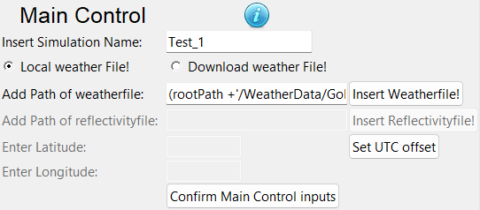 
  

Using the "Insert Weatherfile!" button you can point to the file on your computer. 
This will need to be in TMY format, further tips on this can be found in the section [Troubleshooting](#troubleshooting).  

If you don't have the data for the area, you can choose the option "Download weather File!" which will require filling out the fields "Enter Longitude" and "Enter Latitude" to locate a weather file for this region.  

The time period of your simulation will then need to match that of the weather data. This should be set within the Simulation Control tab as per the below image.  

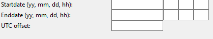 
  

Another important point is to update the Time Zone to match the location in which the simulation is taking place.
This is done within the field "UTC offset" as a + or - value e.g. "+1" for Paris or "-5" for New York. 

---

__Simulation Parameter - Tracking__  

There are two options for solar tracking within the system which can be chosen for the simulation:  

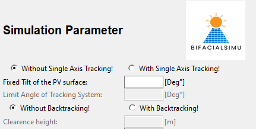 

The first is Single Axis Tracking which will amend the angle of the panels in the horizontal plane to acheive higher efficiencies.
Once this is activated the "Limit Angle of Tracking System" should be set; this is the maximum angle that the modules can rotate to.  

The second option is Backtracking, which aims to reduce the shadowing on modules during extreme sun angles in the morning and evening. 
For this a clearance height has to be entered which should represent distance between the module and the ground.  

---

__Simulation Parameter - Albedo__  

 

Essentially, the choice of albedo simulation mode will depend upon the data available for your simulation. 
You can select from the above four options. 
A detailed explanation for each of these options can be found in the section [Program Function](#program-function) under the heading Albedo Simulation.

The simplest option is to choose "Average measured Albedo" and then choose an option from the drop-down menu. 
This will then take a constant value and implement it in the simulation calculations. 
It is also possible to manually enter a value here based upon literature sources or otherwise, however this will not be saved and therefore should be taken note of.

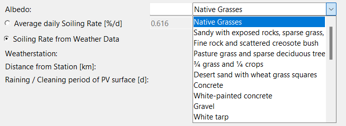 

If you choose to use the option "Hourly Spectral Albedo" you will need a separate "Reflectivity File" which should be inserted under the section Main Control as per the below picture.

 
  

---

__Simulation Control - Simulation Options__

This example runs through how to set the simulation mode for various use cases and important things that should be taken into consideration.
The default setting for simulation is currently to simulate with View Factors on the front side and Ray Tracing on the rear.  

This has the advantage of balancing quick simulation results with an improved accuracy, more can be found on this in the section [Program Function](#program-function) under the heading Electrical Simulation.
Currently it is not possible to utilise Ray Tracing for simulations with a fixed tilt, this is however not disadvantageous, due to how View Factors works with static calculations.  
Each Simulation mode can be selected by clicking on it, with the possibility to simulate the surfaces individually if so desired.  

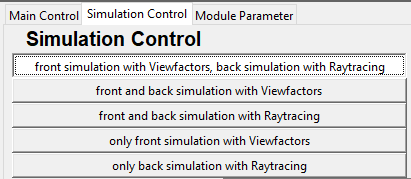 
  

Be aware that when selecting View Factors the simulation will be much quicker than Ray Tracing however with a higher degree of inaccuracy.  

---

__Module Parameter - Module Choice and Electrical Simulation__

This example will show you how to choose and customise the solar module to be simulated.  

The first step is to go onto the tab Module Parameter.
There will be a drop-down menu in the top right corner as per the picture below, with a number of pre-programmed modules available to select from. 

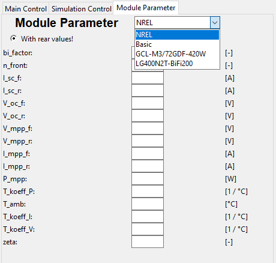 

By selecting a module, the module parameter section will be filled out, depending upon values provided by the manufacturer.
It's important to note here that if no values are provided for any of the rear side, then the electrical simulation will have to be changed to "without rear values" which uses a different simulation mode. More on this can be found in the section [Program Function](#program-function) under the heading Electrical Simulation.  

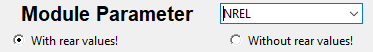 

Once a module has been selected it is also possible to amend the values in each individual field, this can be useful when comparing similar modules that aren't already in BifacialSimu's database. 
These settings however will not be saved so make a note of them for future reference.  

***
## Results
Once a simulation has successfully completed, various graphs will be automatically generated with matplotlib which can then be exported. 
The data for all of these graphs can be found in the simulation results located in the Output folder. 
These graphs will vary depending upon the simulation mode chosen and as such below is a representation of what these could be.   

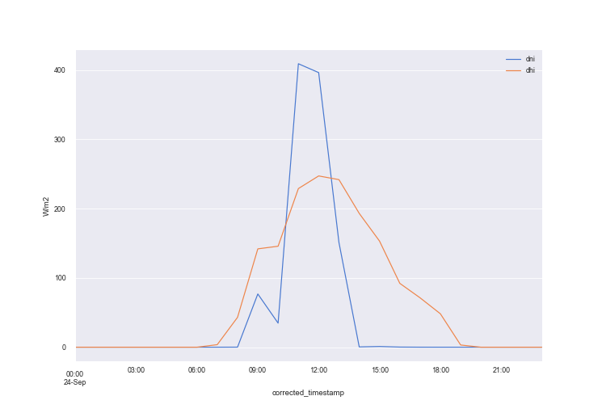 
  

This graph represents the relationship between the Diffuse Horizontal Irradiance (dhi) and the Direct Normal Irradiance (dni) over the course of one day. 
This is shown with the timescale on the x-axis and Watts per square metre on the y-axis.  

 ---

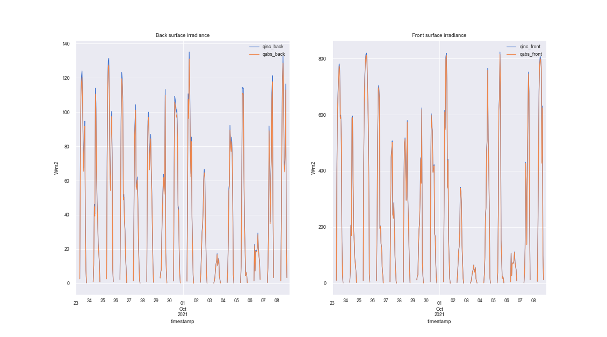 
  

The graph above portrays the Back and Front Side Irradiance with both the total incident irradiance (qinc) and the total absorbed irradiance (qabs) on the respective graphs. 
This
can be a useful comparison tool however make sure to inspect the y-axis for the scale of the results as this could be misleading.  

---

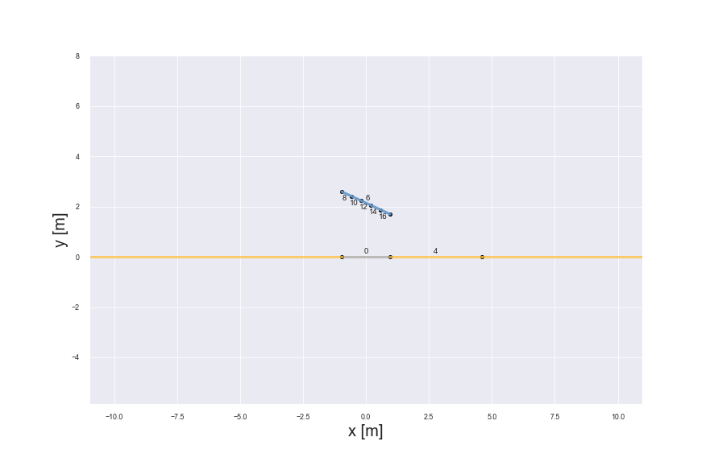 
  

Here is a representation of the PV Array in a ViewFactors simulation. Effectively a graphical drawing of the angles of the modules produced by the integrated pv_factors tool. 
More informatino on this can be found later in [Program Functions](#program-functions).  

---

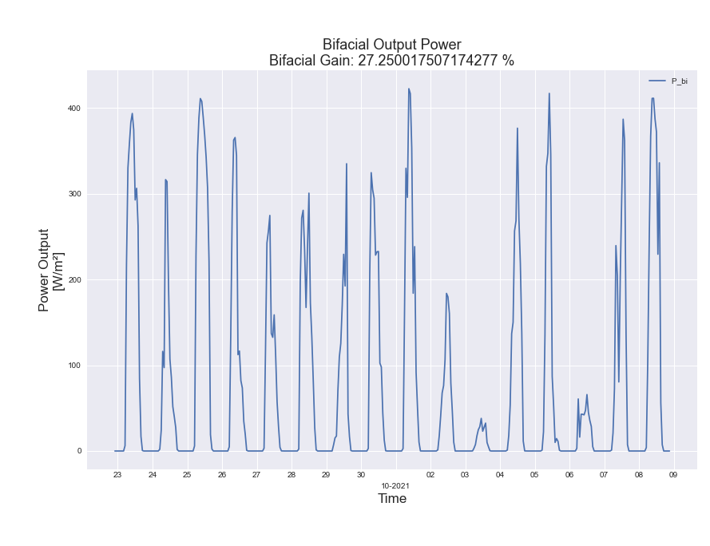 
  

This particular graph shows the Bifacial Power Output in a time series with days on the x-axis and power output on the y-axis. 
The Bifacial Gain is then also protrayed as a percentage, giving a clear indication of how much extra power is being produced by the bifacial modules.  

---

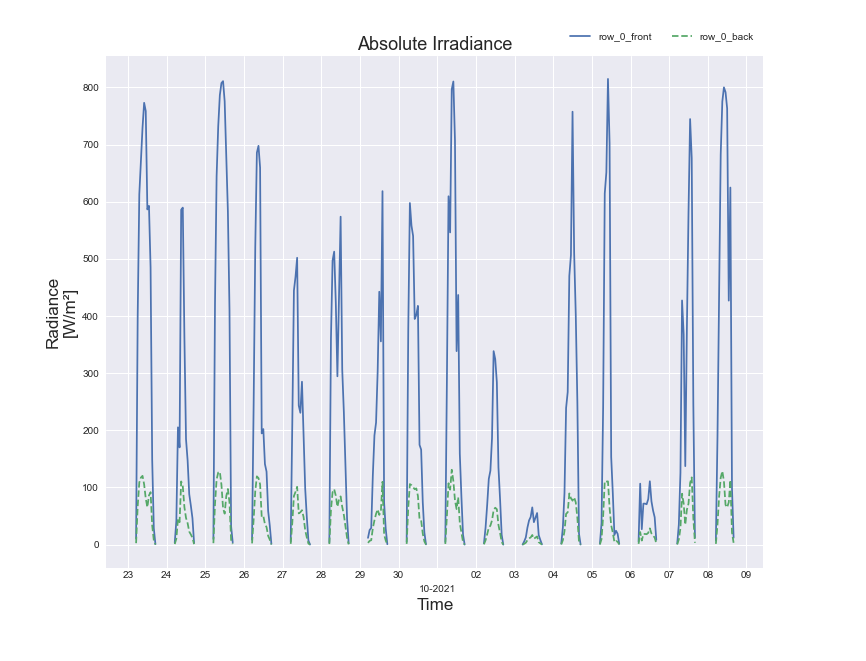 
  

The absolute irradiance on the modules is shown in this graph over the entire simulation period, being displayed in terms of days.  

---

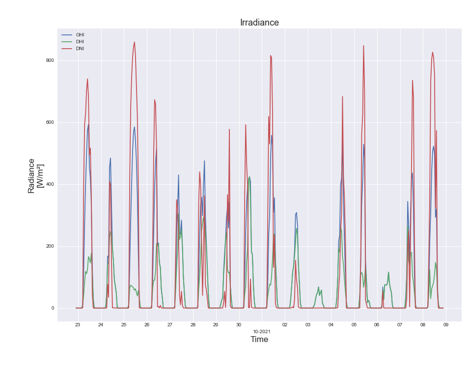 
  

This graph also displays the total irradiance of the system, this time broken down into the Global Horizontal Irradiance (ghi), Diffuse Horizontal Irradiance (dhi) and Direct Normal Irradiance (dni).

***

## Troubleshooting
Here you can find some general troubleshooting measures which may help when running into problems with the simulation.

__name 'rootPath' is not defined__ - If you get this error, the rootPath was not set beforehand. If you run the GUI.py again, it won't show the error.

__Program unresponsive__ - If the simulation is itself unresponsive and no longer operating correctly it is possible to stop the program within the environment and reload. 

__temp_air Error__ - If the simulation produces this error it may be a sign that the "load" and "main" files from BifacialSimu haven't been copied into the installation of bifacial_radiance correctly. These files should overwrite the files in the bifacial_radiance Lib folder. It is also important that they are installed in the correct location, check within the anaconda installation of bifacial_radiance. 
An example path would be: 
> C:\Users\\[USER]\anaconda3\Lib\site-packages\bifacial_radiance

__Invalid Input__ - Most errors are a case of incorrectly defined parameters, these generally display error messages either as separate windows from the GUI or within the terminal in the Python Environment which BifacialSimu is running in.

__Weather File Data Format__ - It is important to ensure that the imported weather data is included in the correct format and file type. This should be a .csv file and an example of how the data should be formatted can be seen in the included data file for the default simulation, the path of which can be found by clicking on "set default" within the GUI. 
There is also a script to convert weather files into TMY formate which can be found within the folder:
> WeatherData/weatherFilesToTMY.py

__Incorrect Timescale on Graphs__ - This is a result of not changing the time zone under the Simulation Control settings. 
It is also possible to manually amend the axis titles within the matlibplot graphs by using the edit button.

__Cannot load backend 'Qt5Agg'__ - If this error appears, you have to change the IPython Console from 'tk' to 'Qt5', f.e. in spyder.
> "ImportError: Cannot load backend 'Qt5Agg' which requires the 'qt' interactive framework, as 'tk' is currently running."

***

## Program Function
BifacialSimu uses various simulation methods in order to acheive it's results which can be split into three distinct groups; Irradiance Simulation, Albedo Calculation & Electrical Simulation. 
Through varying methods in each of these Simulations a comprehensive and accurate simulation can be constructed with varying degrees of accuracy according to the application.  

In comparison to some other simulation tools, BifacialSimu is purely focused on the comparison of bifacial solar modules in comparison to their monofacial counterparts. 
As such, various aspects are not taken into consideration such as losses due to DC-AC inverters, cabling, battery management or other similar components commonly found in PV systems. 
This simplified aspect means that the simulation is easier to set up and provides enough information as to whether the implementation of a bifacial PV system over a standard one will be worth it.

### Irradiance Simulation  
The irradiance has essentially three main simulation modes that can be implemented, these are a combination of two different simulation methods and how they are applied to the solar modules. 
These methods are explained in simple terms below with the view of how to use them in a simulation environment and what is important to consider for which method. 
These use scripts from pv_factors and bifacial_radiance, the use of which is determined by the simulation mode. 
For instance simulations with View Factors will utilise pv_factors, whereas Ray Tracing simulations use bifacial_radiance. 
These can then, as previously described, be combined or used separately accordingly.

__View Factors__  
View Factors is a commonly used method for calculating irradiance and is based upon basic geometric calculations and the relationships between the angles of which. 
This consists in simulation terms of 2D Geometries, in which the PV Arrays are plotted as rows and the ground plotted according to shaded and illuminated areas. 
A graphical depiction of which can be seen in the [Results](#results) section with Figure 3. 
The illuminated and shaded sections naturally change according to the angle of the Sun and at points there may be overlapping which will also be taken into account by the software. 
The fixed parameters of hub height, module size, number of rows and width of rows remain constant during the simulation and define the previously mentioned geometry. 
This 2D model means that back surface irradiation can only be calculated vertically and not laterally.

__Ray Tracing__  
BifacialSimu builds upon the work previously done by NREL with the tool bifacial_radiance which itself uses the rendering program Radiance to produce accurate Ray Tracing models for PV Simulation.  
Ray Tracing is a relatively new technique in terms of PV simulation and is a method of rendering light sources either from the source (Forward Ray Tracing) or alternatively from the geometry back to the light source (Reverse Ray Tracing). 
The latter of which is used within BifacialSimu as this is much more efficient and much simpler to compute.  
This technique has the advantage of being able to accurately calculate the irradiation in a 3D environment as well as involving the use of complex geometries and how the light rays then interact with them. This is naturally an lot more calculation-intensive and results in longer simulation times however this accuracy is much more important when using systems with tracking where the angles result in extrememly complex mathematical calculations.  

Another aspect of Ray Tracing and where it differs from View Factors is the way in which the irradiation and sky are depicted. 
For this either a Cumulative Sky model is produced whereby an entire Sky model is produced on an annual basis. As such this simulation mode takes a lot longer than View Factors, with the building of the sky being quite an intense task. 
This should be taken into consideration when setting up your simulation and especially considering how long the simulation time period should be.  

Reverse Ray Tracing lends itself well to applications where complex geometries are used i.e. the framing and mounting should be considered, and also if tracking is being implemented. 
By default BifacialSimu uses Ray Tracing for the rear side as this provides the most accurate results, an important factor when calculating bifacial gain.

### Albedo Calculation  
The albedo plays a large role when calculating bifacial PV systems, as this is responsible not only for calculating the reflected diffuse irradiation on the front side of the modules but also almost the entire irradiance received by the rear side of the modules. 
As such the model and values used will influence the accuracy of the simulation greatly.  
Albedo is affected not only by the surface but also the weather and time of year in which the simulation should take place. 
As such, it is best to use measured data from the area in which the simulation should take place and during a similar time period when possible.

__Spectral Albedo Model__  
This model calculates the spectral albedo of the surface selected and is dependent on not only the spectral reflectance of the material (measured and stored in a separate reflectivity file as a matrix of values) but also the atmospheric irradiance and how they interact with each other. 
This is an effective way of modelling the albedo for simulations, however it is quite computationally intensive and dependent on accurate weather data and comprehensive albedo values.

__Simplified Variable Albedo Model__  
The simplified variable albedo model uses the basic albedo value of a surface and implements a calculation based upon the position of the sun and how this varies the albedo. 
This is a slightly more accurate solution to the constant albedo value however it is still heavily dependent on the constant value.

__Hourly Albedo Measurement Data__  
It is also possible to use previously measured hourly albedo values for further simulations, this can be useful for validation of the bifacial gain of a new module within BifacialSimu or alternatively then a way to find out how other modules would function in this particular scenario.

Please note that the use of hourly measured albedo values is not possible with fixed tilt simulations at this point in time.

__Constant Albedo Value__  
This is the simplest and therefore least accurate implementation of albedo in the simulation. 
It relies on a simple, average value of the ground's albedo and inputs this into the irradiance calculation for the front and rear sides. 
These can be selected with the drop-down menu according to what the surface is made of, or alternatively a custom numerical value can be entered. 
Please note that the name of the Surface will not be amended after entering a custom value.

### Electrical Simulation  
There are two main electrical simulation methods that are used in BifacialSimu, both of which are variations on the One Diode Model for calculating the power produced by PV modules. 
The use of either is dependent on whether the rear side irradiance values for the modules are present, these being determined by the manufacturer.

__One Diode Model for bifacial PV__  
This standard model for photovoltaic simulation uses separate calculations for the front and rear side of the module with these then being added together to calculate the total energy yield of the system. This calculation requires the use of rear side irradiance values, as such if the selected module doesn't have these it will not be possible to use this mode.

__Simplified One Diode Model__\
The Simplified One Diode Model should be used when there aren't any values for the rear side of the modules which can be the case depending upon the manufacturers specification. 
This model then calculates the energy yield of a bifacial module purely using the front side of the module and the bifaciality factor to calculate the rear side yield.

***
## Contribution
The development of this program was assisted by the following people:

Sarah Glaubitz (Spectral Albedo)  
Frederik Klag (Ray Tracing)  
Sebastian Nows (Ray Tracing)  
Felix Schemann (Variable Albedo, Ray Tracing)  
Jan Schmitt (Graphical User Interface)  
Fares Aoun (Installation Procedure)
Jan Steinke (Threading)

Thank you to all who have contributed so far to this project, it wouldn't have been as successful without their input.

If you wish to assist in further developing this program please contact [Eva-Maria Grommes](https://orcid.org/0000-0002-7826-3754).

***
## Citation and License of pvfactors and bifacial_radiance
BifacialSimu applies parts from [pvfavtors](https://github.com/SunPower/pvfactors). [Copyright (c) 2017, SunPower Corp](https://github.com/SunPower/pvfactors/blob/master/LICENSE):
>Anoma, M., Jacob, D., Bourne, B. C., Scholl, J. A., Riley, D. M., & Hansen, C. W. (2017). View Factor Model and Validation for Bifacial PV and Diffuse Shade on Single-Axis Trackers. In 44th IEEE Photovoltaic Specialist Conference.

BifacialSimu applies parts from [bifacial_radiance](https://github.com/NREL/bifacial_radiance). [Copyright (c) 2017-2021, Alliance for Sustainable Energy, LLC](https://github.com/NREL/bifacial_radiance/blob/main/LICENSE):
>Ayala Pelaez and Deline, (2020). bifacial_radiance: a python package for modeling bifacial solar photovoltaic systems. Journal of Open Source Software, 5(50), 1865, https://doi.org/10.21105/joss.01865

***

## Citation of BifacialSimu
If you use BifacialSimu in a published work, please cite:

> Grommes, Eva-Maria (2022). BifacialSimu, https://github.com/cire-thk/BifacialSimu \

> E. Grommes, U. Blieske, J. Müller-Ost , "The Impact of Albedo Measurements on Power Density Calculations of Bifacial Modules," 37th European Photovoltaic Solar Energy Conference and Exhibition, 2020, pp.1228 - 1232, doi:  10.4229/EUPVSEC20202020-5BO.6.5. \

>E. Grommes, U. Blieske, J. Müller-Ost , "Performance Estimation of Bifacial PV Systems using the View Factor Matrix," 15th Conference on sustainable development of energy, water and environment systems, 2020, Cologne, Germany

***
## License

BifacialSimu open source code is copyrighted by Eva-Maria Grommes and licensed with BSD-3-Clause terms, found [here](https://github.com/cire-thk/BifacialSimu/blob/master/LICENSE).
